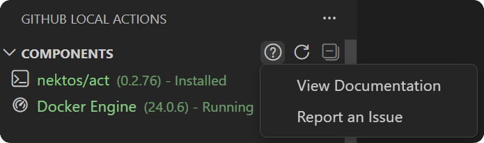
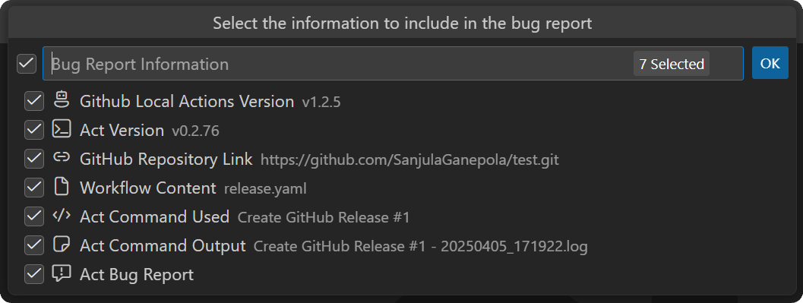

import { CardGrid, Card, LinkCard } from '@astrojs/starlight/components';

## Resources

Check out these external documentation resources to help you make the most of GitHub Local Actions!

<CardGrid>
  <LinkCard title="nektos/act Documentation" href="https://nektosact.com"
  description="Learn the basic and advanced CLI options in nektos/act."/>
  <LinkCard title="GitHub Actions Documentation" href="https://docs.github.com/en/actions"
  description="Learn how to write effective GitHub Action workflows."/>
  <LinkCard title="Visual Studio Code Documentation" href="https://code.visualstudio.com/docs"
  description="Learn about all the features built into Visual Studio Code."/>
</CardGrid>

## Bugs and Feature Requests

If you have any feature requests specific to GitHub Local Actions, please feel free to [open an issue](https://github.com/SanjulaGanepola/github-local-actions/issues) or post on the [discussion board](https://github.com/SanjulaGanepola/github-local-actions/discussions).

:::note
For any bugs or feature requests related to nektos/act specifically, please open an issue on the [nektos/act](https://github.com/nektos/act/issues) repository.
:::

## Report an Issue

If you ever run into an issue, please report it by [opening an issue](https://github.com/SanjulaGanepola/github-local-actions/issues). It is recommended to do this directly in VS Code by navigating to any view and selecting the **Report an Issue** option under the **Help and Support** submenu.

Selecting this option will prompt you for various things to include in the bug report. Some options will only be visible as long as you have all components running and a workflow opened in the editor. Upon selecting the relevant pieces of information to include, you will be taken to the GitHub issue page where a bug report template has been populated. From here, you can then modify and submit the issue.

